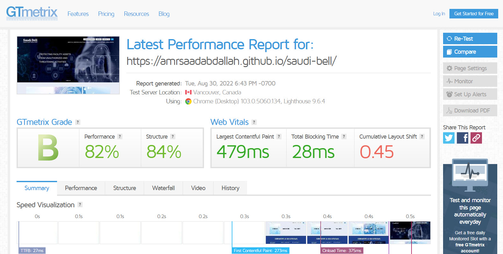

<h1 align="center">  Saudi Bell Template </h1>

### 👁️ Project Preview:

- [ Live Preview 👉 https://amrsaadabdallah.github.io/saudi-bell](https://amrsaadabdallah.github.io/saudi-bell)

- [ Github Repo 👉 https://github.com/amrsaadabdallah/my-saudi-bell](https://github.com/amrsaadabdallah/my-saudi-bell)
  - 🚩 It's a private repo <a target="_blank" href="mailto:amrsaadabdallah@gmail.com">contact me </a>to see.

---

### 📝 Project Description & features:

- It's a Multi page project used to practice HTML5, CSS3, SASS, Bootstrap5, Vanilla JS.
- It's a bilingual website (English , Arabic).
- It consists of 10 pages (Home, About, it service , communication service , security service , clients, partners , careers, Contact , media center).

---

### 🛠️ Project Tools:

1. SASS.

1. Fontawsome icons library.

1. Bootstrap Classes for styling.

1. [Owl Carousel 2](https://owlcarousel2.github.io/OwlCarousel2/) is a jQuery plugin that used to create beautiful responsive carousel slider.

1. [jQuery Validation](https://jqueryvalidation.org/) is a jQuery plugin that used to Form validation.

1. ParcelJS a Bundler Tool.

1. [Squoosh](https://squoosh.app/) is an online tool for image compression web app that reduces image sizes through numerous formats.

1. [compress pdf](https://www.ilovepdf.com/compress_pdf) is an online tool for Compressing  or optimize PDF files to get the same PDF quality but less filesize.

1. [GTmetrix](https://gtmetrix.com/) is an online tool for customers to easily test the performance of their webpages.

---

### :sparkles: Project Skills applied:

1. Practice Bootstrap 5 classes & Components.

1. Practice CSS preprocessor (SASS) features like adding nested rules, variables, mixins, selector inheritance, and more.

1. Applied Desktop first technique to create a responsive web app.

1. Write Vanilla JavaScript to create a dynamic web app, EX:

   - Toggler button & navlist in small screen.
   - Sticky navbar.
   - Handle smooth scrolling in internal navigation
   - Update Current year functionality
   - Handle scroll to top button functionality

1. Carousel using [Owl Carousel 2](https://owlcarousel2.github.io/OwlCarousel2/) is a jQuery plugin

1. Form validation using [Owl Carousel 2](https://owlcarousel2.github.io/OwlCarousel2/)   jQuery plugin.

1. Compression pdf files using [compress pdf](https://www.ilovepdf.com/compress_pdf)  tool.

1. Compression images using [Squoosh](https://squoosh.app/) tool.

1. Bundle project by using Parceljs.

1. Test the performance of the webpage after deploy by using [GTmetrix](https://gtmetrix.com/).

---

### 🧪 Project performance test:

Test the performance of the webpage after deploy by using [GTmetrix](https://gtmetrix.com/).

---

### 👋 Get In Touch:

- [🌐 Website 👉 https://amrsaadabdallah.github.io](https://amrsaadabdallah.github.io)
- [👔 LinkedIn 👉 https://www.linkedin.com/in/amrsaadabdallah](https://www.linkedin.com/in/amrsaadabdallah)
- [🌟 Github 👉 https://github.com/amrsaadabdallah](https://github.com/amrsaadabdallah)
- [📧 Gmail 👉 amrsaadabdallah@gmail.com](mailto:amrsaadabdallah@gmail.com)
- [🐤 Twitter 👉 https://twitter.com/amrsaadabdallah](https://twitter.com/amrsaadabdallah)
- [:phone: Whatsapp 👉 (+20) 109-775-6067](https://api.whatsapp.com/send/?phone=%2B2001097756067&text&type=phone_number&app_absent=0)

---

<a target="_blank" href="https://amrsaadabdallah.github.io">

 2022 &copy; Amr Saad Abdallah 

</a>

